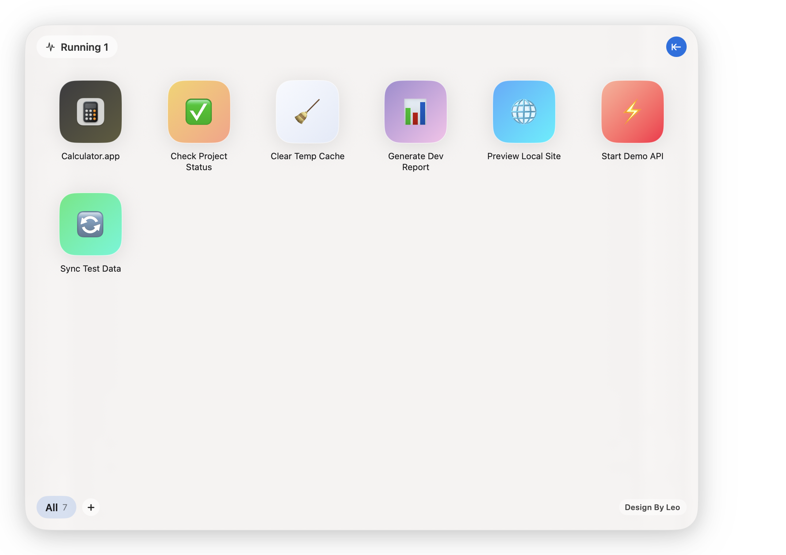
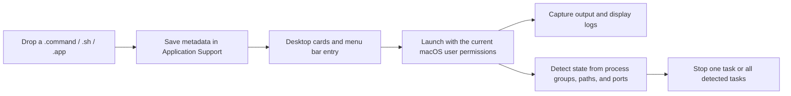

<p align="center">
  
</p>

<h1 align="center">CommandDash</h1>

<p align="center">
  <strong>English</strong> ·
  <a href="README.zh-CN.md">简体中文</a> ·
  <a href="README.ja.md">日本語</a>
</p>

<p align="center"><strong>Turn scattered macOS launch scripts into a visual desktop dashboard you can organize, monitor, and stop.</strong></p>

<p align="center">
  I built CommandDash because a growing collection of <code>.command</code> files becomes difficult to remember, locate, and monitor.
</p>

<p align="center">
  <a href="#why-commanddash">Why CommandDash</a> ·
  <a href="#real-interface">Interface</a> ·
  <a href="#getting-started">Getting started</a> ·
  <a href="#compatibility-and-limitations">Compatibility</a>
</p>

<p align="center">
  
  
  
  <a href="LICENSE"></a>
</p>


| Launch with one click | Know what is still running | Keep launchers organized |
| --- | --- | --- |
| Drop in a `.command`, `.sh`, or `.app`, then launch it from a card or the menu bar. | Detect related processes, PIDs, listening ports, and uptime, with controls to stop them. | Group items into tabs, restore the last selected tab, and customize cards with emoji and gradients. |

## Why CommandDash

Many local tools do not need to become full applications. A static server, synchronization task, or build command is often easiest to keep as a `.command` file. Once there are many of them, however, a Finder folder stops being a useful control panel.

CommandDash gives those launchers a permanent home:

- Start frequently used tasks from the desktop dashboard or menu bar.
- See which tasks are still running without searching through terminal windows.
- Expand the live log panel, copy output, or clear the history.
- Stop one detected task or stop all currently detected tasks.
- Rename launchers, reveal their files, customize their icons, or remove them from the context menu.

## Real interface

These are screenshots of the real application, not concept mockups. They were captured with an isolated public demo profile and contain no private launch commands, project names, ports, or personal paths.

<p align="center">
  
  
</p>

## How it works



CommandDash never stores your launchers in the repository. Application data is saved under:

```text
~/Library/Application Support/CommandDash/
```

This directory contains the launcher list, tabs, and learned runtime fingerprints. Removing the source checkout or cleaning `build/` does not remove this user data.

See [Architecture](docs/ARCHITECTURE.md) for the module-level design.

## Getting started

### Requirements

- macOS 13 Ventura or later.
- Xcode 15 or later, including the Xcode Command Line Tools.

### Build from source

```bash
git clone https://github.com/LeoZhaorx/CommandDash.git
cd CommandDash
./build.sh
open ./build/CommandDash.app
```

The default build produces a universal application for both Apple Silicon and Intel Macs. You can also build a single architecture:

```bash
ARCHS=arm64 ./build.sh
# or
ARCHS=x86_64 ./build.sh
```

The resulting application uses ad-hoc signing. It is intended for local use and development verification, not App Store or Developer ID distribution.

### First use

1. Click `+` at the bottom to create a tab.
2. Drop a trusted `.command`, `.sh`, or `.app` into the window.
3. Click a card to launch it. Option-click to reveal the source file in Finder.
4. Click the running-task indicator in the upper-left corner to inspect processes, ports, and uptime.
5. Use the arrow in the upper-right corner to expand or collapse the runtime log.

## Compatibility and limitations

- The build script targets macOS 13 and cross-compiles both `arm64` and `x86_64`.
- The current release was verified on macOS 15.7.4 with Xcode and Swift 6.2.4. CI continuously checks the universal build and minimum system version.
- Process ownership is inferred from launch sessions, process groups, script paths, and listening ports. Complex daemons, containers, and processes that relaunch themselves may not be identified perfectly.
- Stop actions send `SIGTERM` to the detected process or process group, followed by `SIGKILL` if it remains alive. Confirm ownership before stopping a task.
- CommandDash is not a sandbox and does not inspect script contents. Added files run with the permissions of the current macOS user.
- There is currently no prebuilt download, automatic updater, or Developer ID release pipeline.

## Privacy and publishing boundaries

The repository `.gitignore` excludes:

- `build/` and generated `.app` bundles.
- Every `*.command` file.
- `commands.json`, `tabs.json`, and `runtime_fingerprints.json`.
- Local design notes and macOS metadata.

README screenshots use separate temporary user profiles and neutral example tasks. See [Asset provenance](docs/assets/readme/PROVENANCE.md) for source and processing details.

## Development and verification

```bash
./scripts/verify.sh
```

The verification script checks the universal build, architectures, macOS 13 deployment target, personal paths and product-specific launcher commands, and all local README assets.

## Contributing, security, and license

- [Contributing guide](CONTRIBUTING.md)
- [Security policy](SECURITY.md)
- [MIT License](LICENSE)

Before changing process detection or stop behavior, read [Architecture](docs/ARCHITECTURE.md) and document the task types you tested in the pull request.
