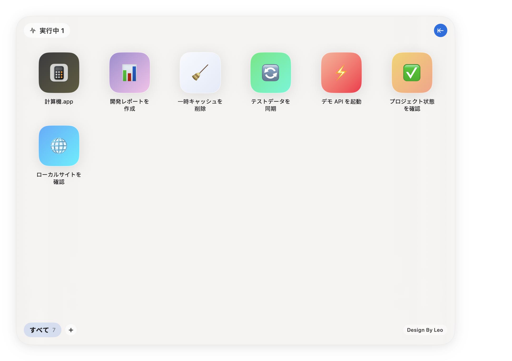
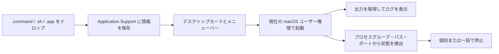

<p align="center">
  
</p>

<h1 align="center">CommandDash</h1>

<p align="center">
  <a href="README.md">English</a> ·
  <a href="README.zh-CN.md">简体中文</a> ·
  <strong>日本語</strong>
</p>

<p align="center"><strong>Finder やターミナルに散らばった macOS の起動スクリプトを、整理・監視・停止できるデスクトップダッシュボードにまとめます。</strong></p>

<p align="center">
  よく使う <code>.command</code> ファイルが増えると、名前や保存場所を覚えにくくなり、実行中かどうかも分かりづらくなります。CommandDash はその問題を解決するために作りました。
</p>

<p align="center">
  <a href="#commanddash-を作った理由">作った理由</a> ·
  <a href="#実際の画面">実際の画面</a> ·
  <a href="#使い始める">使い始める</a> ·
  <a href="#互換性と制限">互換性</a>
</p>

<p align="center">
  
  
  
  <a href="LICENSE"></a>
</p>


| ワンクリックで起動 | 実行状態をすぐ確認 | ランチャーを整理 |
| --- | --- | --- |
| `.command`、`.sh`、`.app` をドロップし、カードまたはメニューバーから起動できます。 | 関連プロセス、PID、待受ポート、実行時間を検出し、停止操作を提供します。 | タブで分類し、最後に選択したタブを復元し、絵文字やグラデーションでカードを変更できます。 |

## CommandDash を作った理由

ローカルツールのすべてを完全なアプリにする必要はありません。静的サーバー、同期処理、ビルドコマンドなどは `.command` ファイルにするのが手軽です。しかし数が増えると、Finder のフォルダーだけでは使いやすいコントロールパネルになりません。

CommandDash はランチャーに固定の場所を用意します。

- デスクトップダッシュボードまたはメニューバーから、よく使うタスクを起動。
- ターミナルウィンドウを探さずに、実行中のタスクを確認。
- リアルタイムログを開き、出力のコピーや履歴の消去。
- 検出したタスクを個別に停止、またはまとめて停止。
- コンテキストメニューから名前変更、Finder での表示、アイコン変更、削除。

## 実際の画面

以下はコンセプト画像ではなく、実際に動作しているアプリのスクリーンショットです。分離した公開デモ用プロファイルで撮影しており、個人の起動コマンド、プロジェクト名、ポート、パスは含まれていません。

<p align="center">
  
  
</p>

## 動作の仕組み



CommandDash は起動項目をリポジトリに保存しません。アプリのデータは次の場所に保存されます。

```text
~/Library/Application Support/CommandDash/
```

ここにはランチャー一覧、タブ、学習した実行時フィンガープリントが含まれます。ソースを削除したり `build/` を消去したりしても、このユーザーデータは削除されません。

モジュール構成については [Architecture](docs/ARCHITECTURE.md) を参照してください。

## 使い始める

### 必要な環境

- macOS 13 Ventura 以降。
- Xcode 15 以降と、Xcode Command Line Tools。

### ソースからビルド

```bash
git clone https://github.com/LeoZhaorx/CommandDash.git
cd CommandDash
./build.sh
open ./build/CommandDash.app
```

標準では Apple Silicon と Intel Mac の両方に対応する Universal アプリを生成します。単一アーキテクチャだけをビルドすることもできます。

```bash
ARCHS=arm64 ./build.sh
# または
ARCHS=x86_64 ./build.sh
```

生成されるアプリは ad-hoc 署名です。ローカル利用と開発確認向けであり、App Store や Developer ID 配布用ではありません。

### 最初の操作

1. 画面下部の `+` をクリックしてタブを作成します。
2. 信頼できる `.command`、`.sh`、`.app` をウィンドウへドロップします。
3. カードをクリックして起動します。Option キーを押しながらクリックすると Finder で元ファイルを表示します。
4. 左上の実行中インジケーターをクリックして、プロセス、ポート、実行時間を確認します。
5. 右上の矢印で実行ログを開閉します。

## 互換性と制限

- ビルドスクリプトは macOS 13 を対象とし、`arm64` と `x86_64` をクロスコンパイルします。
- 現在のリリースは macOS 15.7.4、Xcode / Swift 6.2.4 で検証済みです。CI が Universal ビルドと最低 OS バージョンを継続的に確認します。
- プロセスの所有関係は起動セッション、プロセスグループ、スクリプトのパス、待受ポートから推測します。複雑なデーモン、コンテナ、自動再起動するプロセスは完全に識別できない場合があります。
- 停止操作は検出したプロセスまたはプロセスグループへ `SIGTERM` を送り、終了しない場合は `SIGKILL` を送ります。停止前に対象を確認してください。
- CommandDash はサンドボックスではなく、スクリプトの内容を検査しません。追加したファイルは現在の macOS ユーザー権限で実行されます。
- 現時点ではビルド済み配布、アップデーター、Developer ID リリース手順はありません。

## プライバシーと公開範囲

リポジトリの `.gitignore` は次を除外します。

- `build/` と生成された `.app`。
- すべての `*.command` ファイル。
- `commands.json`、`tabs.json`、`runtime_fingerprints.json`。
- ローカルのデザインノートと macOS メタデータ。

README の画像は、分離した一時ユーザープロファイルと中立的なサンプルタスクを使って作成しています。出典と処理内容は [Asset provenance](docs/assets/readme/PROVENANCE.md) を参照してください。

## 開発と検証

```bash
./scripts/verify.sh
```

検証スクリプトは Universal ビルド、アーキテクチャ、macOS 13 の deployment target、個人パスや製品固有の起動コマンド、README のローカル素材を確認します。

## コントリビューション・セキュリティ・ライセンス

- [Contributing guide](CONTRIBUTING.md)
- [Security policy](SECURITY.md)
- [MIT License](LICENSE)

プロセス検出や停止処理を変更する前に [Architecture](docs/ARCHITECTURE.md) を読み、Pull Request にテストしたタスクの種類を記載してください。
