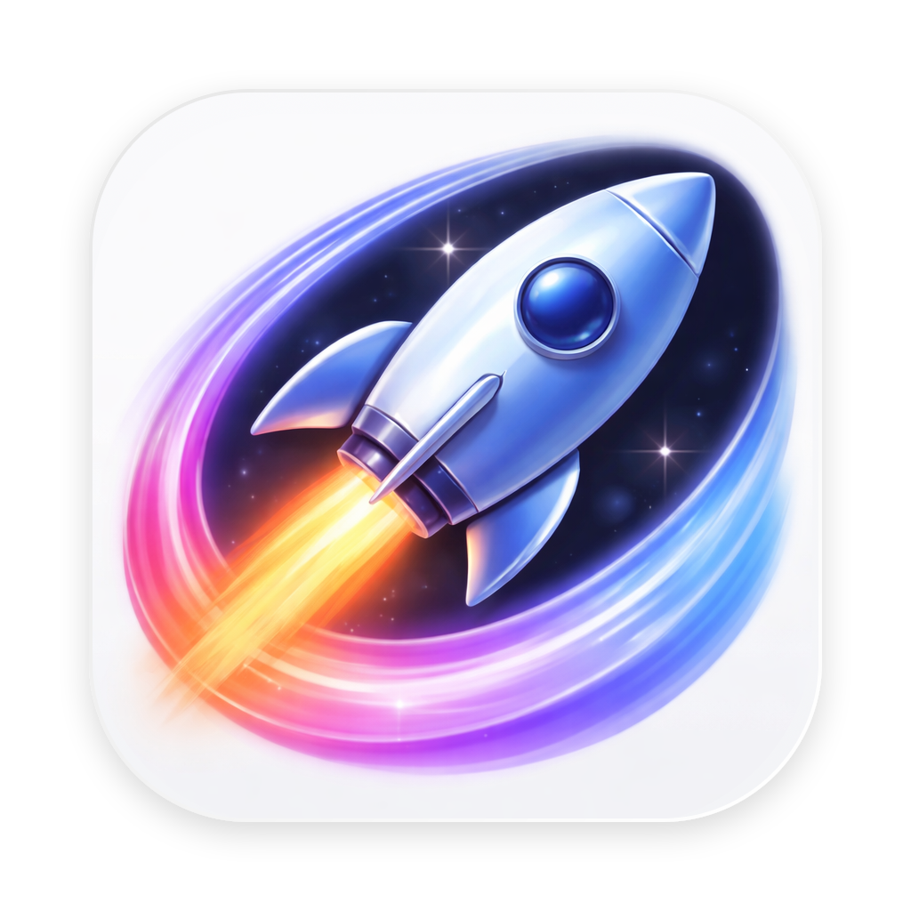
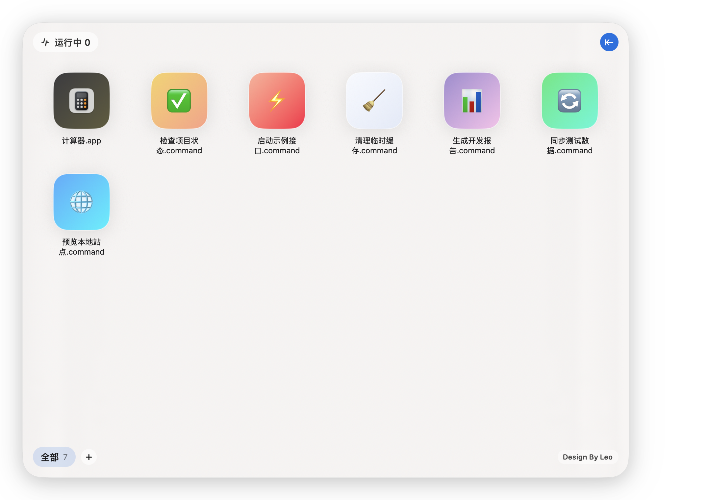
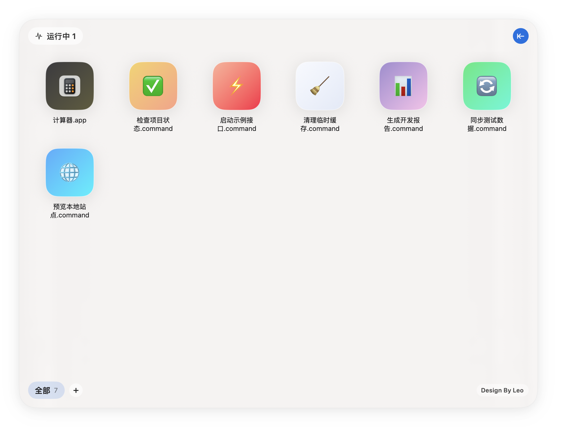
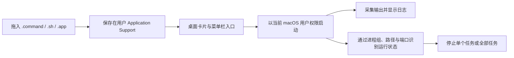

<p align="center">
  
</p>

<h1 align="center">CommandDash</h1>

<p align="center">
  <a href="README.en.md">English</a> ·
  <strong>简体中文</strong> ·
  <a href="README.ja.md">日本語</a>
</p>

<p align="center"><strong>把散落在 Finder 和终端里的 macOS 启动脚本，整理成一个可以看见、分类和停止的桌面面板。</strong></p>

<p align="center">
  我做它，是因为常用的 <code>.command</code> 文件越来越多：名字难记、窗口难找，任务是否还在运行也不够直观。
</p>

<p align="center">
  <a href="#它解决什么">它解决什么</a> ·
  <a href="#真实界面">真实界面</a> ·
  <a href="#开始使用">开始使用</a> ·
  <a href="#兼容性与限制">兼容性</a>
</p>

<p align="center">
  
  
  
  <a href="LICENSE"></a>
</p>



| 点一下就运行 | 状态不用猜 | 启动项不再堆在一起 |
| --- | --- | --- |
| 拖入 `.command`、`.sh` 或 `.app`，之后从卡片或菜单栏直接启动。 | 自动识别相关进程、PID、监听端口和运行时长，并提供停止操作。 | 用 Tab 分类，保留最近选择，并为卡片设置 Emoji 与渐变背景。 |

## 它解决什么

很多本地工具并不值得做成完整 App：一个静态服务器、一段同步脚本、一次构建任务，写成 `.command` 文件最快。但当它们变多以后，Finder 文件夹就不再是一个好用的控制台。

CommandDash 给这些启动项一个固定入口：

- 从桌面面板或菜单栏启动常用任务。
- 看到哪些任务仍在运行，不必翻找终端窗口。
- 展开实时日志，复制输出或清空记录。
- 按任务停止，或者一次停止当前识别到的全部任务。
- 通过右键菜单重命名、定位文件、调整图标或删除启动项。

## 真实界面

下面的图片来自真实应用运行，不是概念稿。截图使用隔离的公开示例数据生成，没有包含作者本机的启动命令、路径和项目名称。

<p align="center">
  
  
</p>

## 工作方式



CommandDash 不会把你的启动项写进仓库。应用数据保存在：

```text
~/Library/Application Support/CommandDash/
```

其中包含启动项列表、Tab 和运行识别指纹。卸载源码或清理 `build/` 不会自动删除这些数据。

更详细的模块说明见 [架构文档](docs/ARCHITECTURE.md)。

## 开始使用

### 环境要求

- macOS 13 Ventura 或更新版本。
- Xcode 15 或更新版本，以及随 Xcode 提供的 Command Line Tools。

### 从源码构建

```bash
git clone https://github.com/LeoZhaorx/CommandDash.git
cd CommandDash
./build.sh
open ./build/CommandDash.app
```

默认会生成同时支持 Apple Silicon 和 Intel Mac 的通用应用。也可以只构建当前需要的架构：

```bash
ARCHS=arm64 ./build.sh
# 或
ARCHS=x86_64 ./build.sh
```

构建结果使用 ad-hoc 签名，适合本地使用和开发验证，不是 App Store 或 Developer ID 发行包。

### 第一次使用

1. 点击底部 `+` 创建一个 Tab。
2. 把可信的 `.command`、`.sh` 文件或 `.app` 拖进窗口。
3. 点击卡片启动；按住 Option 点击可在 Finder 中定位文件。
4. 点击左上角“运行中”查看进程、端口和运行时间。
5. 点击右上角箭头展开或收起运行日志。

## 兼容性与限制

- 构建脚本把 deployment target 固定为 macOS 13，并交叉编译 `arm64` 与 `x86_64`。
- 当前发布检查在 macOS 15.7.4、Xcode/Swift 6.2.4 上完成；CI 会持续验证通用构建和最低系统版本声明。
- 进程归属通过启动会话、进程组、脚本路径和监听端口推断。复杂的守护进程、容器或二次拉起流程可能无法完全识别。
- “停止”会向识别到的进程或进程组发送 `SIGTERM`，仍未退出时再发送 `SIGKILL`。请先确认任务归属。
- CommandDash 不是沙箱，也不审查脚本。它会以当前用户权限运行你主动添加的文件。
- 当前没有预编译下载、自动更新和正式代码签名流程。

## 隐私与发布边界

仓库通过 `.gitignore` 排除：

- `build/` 与 `.app` 构建产物。
- 所有 `*.command` 文件。
- `commands.json`、`tabs.json` 和 `runtime_fingerprints.json`。
- 本地设计笔记与 macOS 元数据。

README 图片使用单独的临时用户目录和中性任务生成。素材来源与处理说明见 [PROVENANCE.md](docs/assets/readme/PROVENANCE.md)。

## 开发与验证

```bash
./scripts/verify.sh
```

验证脚本会执行通用构建、架构检查、macOS 13 最低版本检查、个人路径/特定启动命令扫描，以及 README 本地资源检查。

## 贡献、安全与许可

- [贡献指南](CONTRIBUTING.md)
- [安全策略](SECURITY.md)
- [MIT License](LICENSE)

如果你准备修改进程识别或停止逻辑，请先阅读 [架构文档](docs/ARCHITECTURE.md)，并在 Pull Request 中说明测试过的任务类型。
